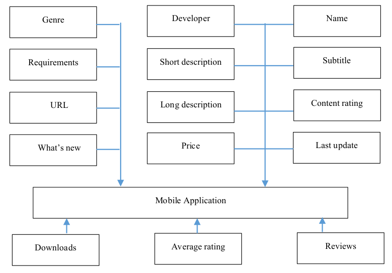
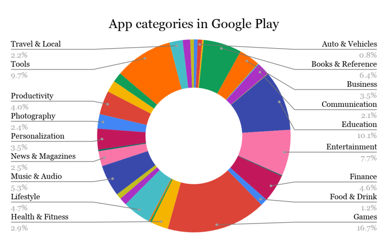
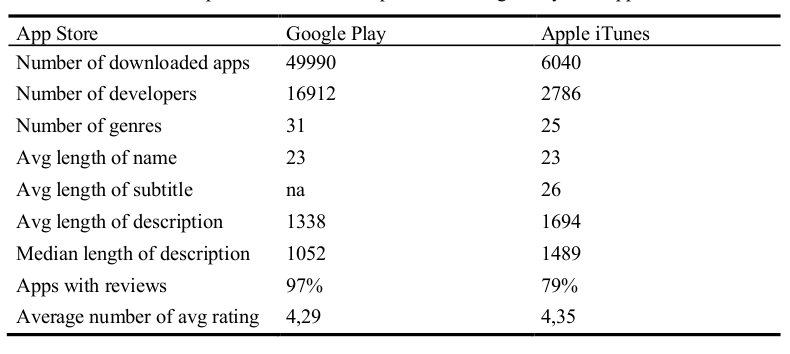
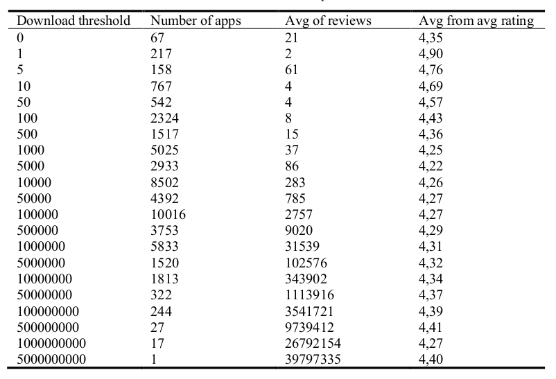

# A Framework for App Store Optimization

<html xmlns="http://www.w3.org/1999/xhtml" lang="en"><head>
<meta http-equiv="content-type" content="text/html; charset=UTF-8">
        <meta charset="UTF-8">
        <meta name="viewport" content="width=device-width, initial-scale=1.0">
    </head>
    <body>
         <h2>A Framework for App Store Optimization</h2>
         

         
Artur Strzelecki1[0000-0003-3487-0971] 
            1
            University of Economics in Katowice, Katowice 40-287, Poland 
            artur.strzelecki@ue.katowice.pl 

         
<b>Abstract.</b> In this paper a framework for app store optimization is proposed. The
            framework is based on two main areas: developer dependent elements and user
            dependent elements. Developer dependent elements are similar to factors in
            search engine optimization. User dependent elements are similar to activities in
            social media. The proposed framework is modelled after downloading sample
            data from two leading app stores: Google Play and Apple iTunes. Results show
            that developer dependent elements can be better optimized. Names and descrip-
            tions of mobile apps are not fully utilized.

        
<b>Keywords:</b> App Store Optimization, Google Play, Apple iTunes, Mobile App
            Store.

            <h2>1. Introduction</h2> 
        
Together with increasing use of mobile devices there is increased supply of applications
            (apps) used on mobile devices. Software companies and developers create apps that
            installed on mobile device can be useful for mobile device owners. Now in two most
            popular app stores (iTunes and Google Play) are available millions of apps. Apps are
            offered in these stores in different categories of software, however still, competition is
            very high between apps in one category. Competition means that many apps offer sim-
            ilar functions and user can browse and choose from variety of selection.

            

            This creates a need to propose a framework of app store optimization. App store
            optimization also can be described as app store marketing or mobile app search engine
            optimization. The focus is to improve ranking of mobile app directly within app store.
            Recently [1] noticed that developers make efforts to improve mobile app visibility in
            app store, but some of such actions can be treated as fraud. Especially when it comes
            to reviews and downloads, they can be pumped by developer. There is limited research
            on factors which are taken into account when apps ranking is created. Since apps are
            created by developers and used by users, ranking is influenced by these two groups.
            App store optimization has its roots in search engine optimization, where different fac-
            tors are taken into account, when it comes to create ranking of websites. Earning from
            achievement in the field of search engine optimization author propose a framework for
            app store optimization. There are identified similarities between these two areas.

            The research question is what factors are used for creating ranking of mobile apps
            directly in app store. Author in this paper propose a framework for ranking in app store
            optimization. This paper is organized as follows. Section 2 contains a review of the

            
relevant literature on app stores and optimization in search engines area. In section 3
                author describe the research method for choosing factors to propose framework. Sec-
                tion 4 contains characteristics of the sample date which are collected from iTunes and
                Google Play. In section 5 author highlight the contribution of the research and suggest
                possible implications of results, analyze current limitations of the research, draw con-
                clusions and present ideas as for their future research on app store optimization.

            <h2>2. Literature Reviews</h2>
                
In literature review two areas are explored. First is about efforts made by app develop-
                    ers to promote apps in app store and user’s which rate and review apps. Developer
                    creates app and deliver it to app store. After software is delivered it can be offered with
                    free app offers, continuous quality updates, investment in less popular (less competi-
                    tive) categories and price changes [2]. New releases are found to change user opinion
                    on app [3]. Number of rating, number of reviews, number of downloads are always
                    positively changed, since they only can rise. Some developers update their apps very
                    frequently, even once a week or twice a month. They are not too concerned about de-
                    tailing the content of new updates and users are not too concerned about such infor-
                    mation, whereas users highly rank frequently-updated apps instead of being annoyed
                    about the high update frequency [4]. App rating is assigned to an app over its entire life
                    time is aggregated into one rating that is displayed in the app store. However many apps
                    do increase their version-to-version rating, while the store-rating of an app is resilient
                    to fluctuations once an app has gathered a substantial number of raters [5]. The ap-
                    proach is proposed to assisting developers to select the proper release opportunity based
                    on the purpose of the update and current condition of the app [6]. Developer also can
                    do a shady moves to fraud app ranking. [1] defined two methods of fraud: inflate the
                    app number downloads and ratings in a very short time.

                    

                    User can publish review about app. Reviews have a major influence on the user’s
                    purchase decision [7]. Average rating according to the star principle as well as the num-
                    ber of reviews given determine the buying decision of an app to a very large degree.
                    Review area is explored when it comes to see what the sentiment of the review is. Re-
                    view can have positive or negative sentiment [8]. Analyzing reviews is done by text
                    mining [9]. Most of the feedback is provided shortly after new releases, with a quickly
                    decreasing frequency over time. Reviews typically contain multiple topics, such as user
                    experience, bug reports, and feature requests [10]. Reviews are source for users’ feed-
                    back, requests for new features or reporting bugs. Reviews represent feature requests,
                    i.e. comments through which users either suggest new features for an app or express
                    preferences for the re-design of already existing features of an app [11]. Reviews can
                    be specific, as specific is an app. Analyzing feedbacks from a health and fitness-track-
                    ing app shows that the users of health and fitness-related apps are concerned about their
                    physical activity records and physiological records. The records include track, distance,
                    time, and calories burned during jogging or walking. App store reviews are used to
                    analyze different aspects of app development and evolution [12]. There are proposed
                    frameworks to acquire reviews in large number, extract informative user reviews by

                
filtering noisy and irrelevant ones, then group the informative reviews automatically
                    using topic modeling [13, 14]. There also systematic literature reviews where of opin-
                    ion mining studies from mobile app store user reviews, which describes and compares
                    the areas of research that have been explored thus far, drawing out common aspects, in
                    app store analysis [15, 16].

                    

                    Second area in literature review is search engine optimization. Since app store rank-
                    ing is generated based on different factors, drawing from area of web search engines
                    can help to build framework for app store optimization. Web search engines use dif-
                    ferent factors identified on and off website to determine ranking of certain webpage in
                    search engines. In the beginning ranking factors were limited only to few elements
                    taken into account when search engine results pages were created [17, 18]. Nowadays
                    this topic is more explored and can be divided into onsite factors and offsite factors.
                    Onsite factors are domain-related, website-related and page related [19]. Offsite factors
                    are link-related [20], user-action-related [21], special-rules-related [22], brand-related
                    [23] and spam-related [24].

                    <h2>3. Frameworks Model</h2>
                    
App stores distribute apps through the app store and have additional information about
                        the app. A set of information is initially set by the developer. The app is delivered by
                        the app developer. The developer sets a name for the app and creates a description of
                        app features. The app is published with the new original url. The developer sets genre
                        content rating and define system requirements for an app. Apps can be distributed
                        through the app store for free or user needs to pay to download. Free apps can also offer
                        in-app purchases for additional features. Another set of information is created after app
                        is released. Users are downloading the app and make the number of downloads grow-
                        ing. User can also create reviews and rate an app in range of scale from 1 to 5.
 
                    

                        
                    
                        
                    
Data for analysis and further usage in framework for app store optimization were col-
                        lected from Google Play and Apple iTunes. Author used an automated software for
                        websites crawling - Screaming Frog SEO Spider, which retrieved data, divided into
                        several groups based on their type. Two different techniques for retrieving were used.
                        First technique applied regular expressions to match elements like number of down-
                        loads, last date of update, content rating, range of pricing and software requirements.
                        The second technique used CSSPath to match the next elements like developer, number
                        of reviews, category, name, average rating. The URL was also retrieved for each appli-
                        cation during the crawling process.

                        

                        These two different techniques were needed, because some of the elements are writ-
                        ten down firmly into a website structure and are always placed in the same context.
                        These were retrieved by the CSSPath. The rest of elements can change their position in
                        website structure, due to the incomplete data provided by the developer. Some of the
                        apps in Google Play and Apple iTunes do not have all of the information usually dis-
                        played on app store. Regular expressions helped to collect the published in different
                        part of websites.

                        Framework proposition is based on two areas. One area depends on the developer.
                        Its content and settings are provided when the app is initially released in app store.
                        Second area depends on users. If the app is being popular among user, they are starting
                        to download and create reviews or rate the app in the app store.

                        <h2>3.1
                            Framework elements dependent on developer</h2>
                        
<b>Developer.</b> The name of the developer is also a ranking factor, affecting directly the
                            position of the application itself. The positive history of the developer affects the better
                            evaluation of the application in the search ranking. Keywords in the developer's name
                            affects each of its applications.

                            
<b>Name.</b> The name of the application is important both for the app store optimization and
                            for the experience. Often observed solution made by developers is to create a name by
                            combining the brand name and the most important key words for the app. Google Play
                            limits the name to 50 characters, whereas Apple iTunes limits the name to 30 characters.
                            Subtitle. (Only in Apple iTunes) Subtitle is placed right below the title and brings ad-
                            ditional information on mobile app. It complements the app name by communicating
                            the purpose and value of app in details and is limited to 30 characters.
                            Genre. Genre is a category for software. Currently Google Play offers 31 categories
                            for mobile apps and Apple iTunes offers 28 categories.

                            
<b>Description.</b> App stores allows to prepare two types of description, short and long ver-
                            sion. The short version is only visible in mobile app store and its maximum length is
                            80 characters for Google Play and 170 characters for Apple iTunes. Long version is
                            also visible in a desktop version and the maximum size is 4000 characters. However,
                            only around 250 characters is visible after description is displayed, the rest is hidden. It
                            can be showed after clicking button “Read more”.

                            
<b>Content rating.</b> A content rating rates the suitability of mobile applications for its au-
                                dience. It tells what age group is suitable to use mobile app.
                                Requirements. App store providers require that new apps target operating system ver-
                                sion. System version is set in requirements. For new apps requirement in Google Play
                                is at least Android 8.0 and in Apple App Store is at least iOS 12. Older apps can have
                                lower operating system requirements.

                                
<b>URL.</b> The URL can only be defined when the application is published, hence it is an
                                element worth refining.

                                
Last update.
                                 (Only in Google Play) For the application store, security is important,
                                therefore the factor that has a ranking importance, but also affects the opinions about
                                the application, is the frequency of its updating. It is necessary to update the application
                                not only at the time of major changes to the functionality of the app, but also at every
                                subsequent update of the operating system.

                                
<b>What’s new.</b> This element is intended to describe the updates introduced into the app.
                                Developers can change the contents of the section only after the new app version is
                                submitted to the store.

                                <h2>3.2
                                    Framework elements dependent on users.</h2>
                                    
<b>Downloads.</b> (Only in Google Play) Downloads is the number of app installation on
                                        devices worldwide. Google Play publishes the only threshold number that has been
                                        reached.

                                        
<b>Average rating.</b> Average rating is a number with one decimal place in the scale from
                                        1 to 5 and it is an aggregated rating from all ratings given by users.
                                        Reviews. Apart from ratings users can write a review about an app. Reviews are a
                                        source for users’ feedback, requests for new features or reporting bugs [25].

    <h2>4 Data and Results</h2>
    <b>4.1 Data</b>
    
In the process of app store mining, author has downloaded from Google Play about 50
        000 apps, which belong to 31 different categories. Additionally, there is the main cate-
        gory Games which includes 17 subcategories (action, adventure, arcade, board, card,
        casino, casual, educational, music, puzzle, racing, role playing, simulation, sports, strat-
        egy, trivia, word). In the downloaded sample games take 16,66% of total number of
        applications, and other apps belong to 31 different categories. Figure 2 represents shares
        of all categories in this sample.

        

            
        
        
        
Table 1 shows the descriptive statistics of 49 990 sample apps downloaded from Google
            Play and 6040 sample apps downloaded from Apple iTunes. Based on downloaded data
            it contains main characteristics. Table 1 also contains framework elements dependent
            on developers based on Google Play and Apple iTunes.

            

                
            
            
            
Autor downloaded smaller sample from Apple iTunes because this app store prevents
                against the massive download of data and after a few hundreds of downloaded apps, it
                turns on the HTTP response code 403 on every page with an app. Table 2 contains

                
framework elements dependent on users based on Google Play like number of down-
                    loads, average number of reviews in download threshold and average from average
                    rating in download threshold.

                    

                        
                    
                    
    <h2>4.2 Results</h2>
    
Data in the Google Play store adapts to language settings of user’s browser and operat-
        ing system. During initial screening the authors have seen different settings coming
        from different languages. First, prices of apps itself or in-app purchases were displayed
        in the currency set in the web browser. Second, the types of content rating were differ-
        ent for different localization settings. Author checked three options of language &amp;
        country setting: Poland, Ukraine and US. For Poland and Ukraine, the rating is dis-
        played in Pan European Game Information (PEGI) standard, while for US the rating
        format comes from the Entertainment Software Rating Board (ESRB) [26]. Third, ex-
        cept for recommending applications on the basis of language and country, Google Play
        provides different search results for authorized and non-authorized users. If not logged
        in into Google account, a user is suggested a set of applications that differs from the
        one an authorized user will get (although the query in both situations is exactly the
        same.

        

        Framework elements depending on developers reveal, that they do not use fully all
        of framework elements. Name of the app can be maximum 30 characters long, however
        average name length is 23 characters. This suggest, that there is still space that can be
        used by developers in name element. Subtitle is an optional element in Apple iTunes.
                                                    
        
Not every app has set subtitle. In sample 41% of apps did not have subtitle. Subtitle can
            be maximum 30 characters long and the average length is 26 characters. This suggest,
            that if the subtitle is used, developers use it in its maximum capacity. Long description
            can be maximum 4000 characters long, however average length is 1338 characters and
            the median 1056 characters long for Google Play and average 1755 characters and me-
            dian 1534 characters for Apple iTunes. This suggest, that there is still space that can be
            used by developers in description element.

            

            Framework elements depending on users reveal that the larger download threshold
            is achieved, the more average reviews apps have. It is linear relationship, which is ex-
            pected, since more downloads can result in more reviews. However, the average rating
            for apps with lowest download threshold is the highest and then for next thresholds is
            decreasing. Average rating is decreasing to 4,22 with threshold of 5000 downloads and
            then is increasing to threshold of 500 million downloads. Users’ framework is built on
            data divided according to download threshold. It shows, that if app is more and more
            downloaded, the overall rating from user is growing. Usually developers are taking into
            account requests made in reviews and update apps with new and requested features.

            
In this paper a framework for app store optimization is proposed. The framework is
                based on two areas. One area is dependent on developer. The developer sets the initial
                setting for each app, which is distributed to the app store. After the app is being distrib-
                uted, users’ engagement in app distribution is second area. Users create number of
                downloads, reviews and overall rating. A framework is proposed for both leading app
                stores: Google Play and Apple iTunes.

                

                Results show that developers are not fully using elements which are dependent on
                them. The lowest use is with description, in Google Play, developers on average use
                33% of its capacity, and in Apple iTunes developers on average us 41% of its capacity.
                Second element which still has some space to use is the name of an app. In both app
                stores, on average developers use 76% of its full capacity.

                

                This paper is a first attempt to create framework, which will explain, what elements
                are taken into account, when the ranking is created in app stores. Framework is created
                on data downloaded from two leading app stores: Google Play and Apple iTunes. This
                framework reveals that this ranking is depending on more than dozen factors. Some of
                these factors are identified in this paper. Author divided them into two groups, where
                one is depending on app developers and the second is depending on the users’ engage-
                ment.

                Proposed framework has some limitations. First is that the framework is proposed
                only on data that is publicly visible and accessible. Perhaps there are some other ele-
                ments taken into this framework, not visible for users. This could be number of app
                uninstalls from device, number of app removals from the app store. Second, it takes
                only data from two app store. There are other app stores like Windows Phone or Black-
                Berry World, which were not taken into building this framework. This could future

        
direction of research, to take also data from these stores and enhance proposed frame-
            work.

            <h2>References</h2>
            

            Zhu, H., Xiong, H., Ge, Y., Chen, E.: Discovery of Ranking Fraud for Mobile
            Apps. IEEE Trans. Knowl. Data Eng. 27, 74–87 (2015).
            https://doi.org/10.1109/TKDE.2014.2320733.

            

            Lee, G., Raghu, T.S.: Determinants of Mobile Apps’ Success: Evidence from
            the App Store Market. J. Manag. Inf. Syst. 31, 133–170 (2014).
            https://doi.org/10.2753/MIS0742-1222310206.

            

            Martin, W., Sarro, F., Harman, M.: Causal impact analysis for app releases in
            google play. In: Proceedings of the 2016 24th ACM SIGSOFT International
            Symposium on Foundations of Software Engineering - FSE 2016. pp. 435–446.
            ACM, New York, USA (2016). https://doi.org/10.1145/2950290.2950320.

            

            McIlroy, S., Ali, N., Hassan, A.E.: Fresh apps: an empirical study of frequently-
            updated mobile apps in the Google play store. Empir. Softw. Eng. 21, 1346–
            1370 (2016). https://doi.org/10.1007/s10664-015-9388-2.

            

            Mojica Ruiz, I.J., Nagappan, M., Adams, B., Berger, T., Dienst, S., Hassan,
            A.E.: Examining the Rating System Used in Mobile-App Stores. IEEE Softw.
            33, 86–92 (2016). https://doi.org/10.1109/MS.2015.56.

            

            Shen, S., Lu, X., Hu, Z., Liu, X.: Towards Release Strategy Optimization for
            Apps in Google Play. In: Proceedings of the 9th Asia-Pacific Symposium on
            Internetware - Internetware’17. pp. 1–10. ACM Press, New York, New York,
            USA (2017). https://doi.org/10.1145/3131704.3131710.

            

            Böhm, S., Schreiber, S.: Mobile App Marketing : A Conjoint-based Analysis
            on the Importance of App Store Elements. 7–14 (2014).

            

            Fu, B., Lin, J., Li, L., Faloutsos, C., Hong, J., Sadeh, N.: Why people hate your
            app. In: Proceedings of the 19th ACM SIGKDD international conference on
            Knowledge discovery and data mining - KDD ’13. p. 1276. ACM Press, New
            York, New York, USA (2013). https://doi.org/10.1145/2487575.2488202.

            

            Martin, W., Harman, M., Jia, Y., Sarro, F., Zhang, Y.: The App Sampling
            Problem for App Store Mining. In: 2015 IEEE/ACM 12th Working Conference
            on Mining Software Repositories. pp. 123–133. IEEE (2015).
            https://doi.org/10.1109/MSR.2015.19.

            

            Pagano, D., Maalej, W.: User feedback in the appstore: An empirical study. In:
            2013 21st IEEE International Requirements Engineering Conference (RE). pp.
            125–134. IEEE (2013). https://doi.org/10.1109/RE.2013.6636712.

            

            Iacob, C., Harrison, R.: Retrieving and analyzing mobile apps feature requests
            from online reviews. In: 2013 10th Working Conference on Mining Software
            Repositories
            (MSR).

            

            https://doi.org/10.1109/MSR.2013.6624001.
            Lai, Y.-H., Huang, F.-F., Chiou, P.-Y.: Analysis of User Feedback in The
            Mobile App Store Using Text Mining: A Case Study of Google Fit. In: 2017
            IEEE 8th International Conference on Awareness Science and Technology
        
                
    
</body></html>
